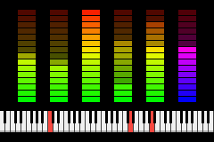

# swarm-nsf
An NSF player for the Gameboy Advance

Instead of relying on the DMG/CGB-compatible channels to try to mimic the NES sound processor, this is an all-software implementation running on the ARM CPU.
The output of the emulation code is a stream of 8-bit unsigned mono PCM data at 32768 Hz, which is played back using one of the GBA's DMA sound channels.

The player currently only supports the 5 built-in sound channels of the NES. I've also made the active decision to only support NSF files with at most 32kB ROM, since knowing that none of the ROM banks will move around during playback allows for certain optimizations that otherwise wouldn't have been possible.
